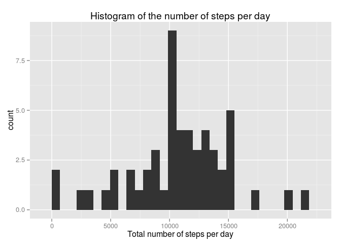
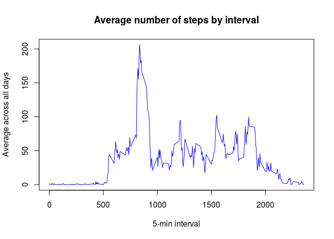
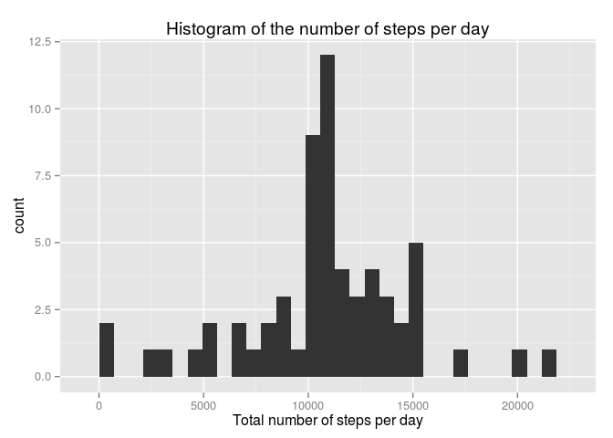

# Reproducible Research: Peer Assessment 1


## Loading and preprocessing the data


```r
#load data
data_activity_init <- read.csv2("activity.csv", sep = ",", header = T)

#convert date into date format
data_activity_init$date <- as.Date(data_activity_init$date)
summary(data_activity_init)
```

```
##      steps             date               interval     
##  Min.   :  0.00   Min.   :2012-10-01   Min.   :   0.0  
##  1st Qu.:  0.00   1st Qu.:2012-10-16   1st Qu.: 588.8  
##  Median :  0.00   Median :2012-10-31   Median :1177.5  
##  Mean   : 37.38   Mean   :2012-10-31   Mean   :1177.5  
##  3rd Qu.: 12.00   3rd Qu.:2012-11-15   3rd Qu.:1766.2  
##  Max.   :806.00   Max.   :2012-11-30   Max.   :2355.0  
##  NA's   :2304
```

```r
#remove all NA
data_activity <- data_activity_init[complete.cases(data_activity_init),]
```


## What is mean total number of steps taken per day?


```r
#Calculate the total number of steps taken per day
steps_per_day <- aggregate(data_activity$steps, by = list(data_activity$date), FUN = sum)
names(steps_per_day) <- c("Date", "Nb.steps")

#ten first lines
head(steps_per_day, 10)
```

```
##          Date Nb.steps
## 1  2012-10-02      126
## 2  2012-10-03    11352
## 3  2012-10-04    12116
## 4  2012-10-05    13294
## 5  2012-10-06    15420
## 6  2012-10-07    11015
## 7  2012-10-09    12811
## 8  2012-10-10     9900
## 9  2012-10-11    10304
## 10 2012-10-12    17382
```

```r
#histogram of the total number of steps taken each day
require(ggplot2)
```

```
## Loading required package: ggplot2
```

```r
ggplot(data=steps_per_day, aes(steps_per_day$Nb.steps)) + geom_histogram() + labs(title = "Histogram of the number of steps per day")+ labs(x = "Total number of steps per day")
```

```
## stat_bin: binwidth defaulted to range/30. Use 'binwidth = x' to adjust this.
```

 

```r
#Calculate and report the mean and median of the total number of steps taken per day
summary(steps_per_day$Nb.steps)
```

```
##    Min. 1st Qu.  Median    Mean 3rd Qu.    Max. 
##      41    8841   10760   10770   13290   21190
```

```r
#specifically, the mean
mean(steps_per_day$Nb.steps)
```

```
## [1] 10766.19
```

```r
#the median
median(steps_per_day$Nb.steps)
```

```
## [1] 10765
```


## What is the average daily activity pattern?

```r
# time series plot of the 5-minute interval (x-axis) and the average number of steps taken, averaged across all days (y-axis)
mean_steps_per_interval <- aggregate(data_activity$steps, by = list(data_activity$interval), FUN = mean)
names(mean_steps_per_interval) <- c("interval", "meanstep")
#A view of the third first lines
head(mean_steps_per_interval, 3)
```

```
##   interval  meanstep
## 1        0 1.7169811
## 2        5 0.3396226
## 3       10 0.1320755
```

```r
#The plot
plot(mean_steps_per_interval, type = "l", xlab = "5-min interval", 
    ylab = "Average across all days", main = "Average number of steps by interval", col="blue")
```

 

```r
#Which 5-minute interval, on average across all the days in the dataset, contains the maximum number of steps?
require(dplyr)
```

```
## Loading required package: dplyr
## 
## Attaching package: 'dplyr'
## 
## The following objects are masked from 'package:stats':
## 
##     filter, lag
## 
## The following objects are masked from 'package:base':
## 
##     intersect, setdiff, setequal, union
```

```r
#filter on the maximum value and take only the first element in the line
filter(mean_steps_per_interval, meanstep == max(meanstep))[[1]]
```

```
## [1] 835
```
## Imputing missing values


```r
#Calculate and report the total number of missing values in the dataset (i.e. the total number of rows with 𝙽𝙰s)
#option1
sum(is.na(data_activity_init))
```

```
## [1] 2304
```

```r
# option 2
nrow(data_activity_init[!complete.cases(data_activity_init),])
```

```
## [1] 2304
```

```r
# Fill all the missing values in the dataset by the mean of that 5-minute interval
fillNaStep <- numeric()
for (i in 1:nrow(data_activity_init)){
        if (is.na(data_activity_init$steps[i])) {
                #select the corresponding interval
                tmp <- data_activity_init$interval[i]
                #look for the mean corresponding to this interval
                meanstep_tmp <- filter(mean_steps_per_interval, interval == tmp)[[2]]
                #fill the value
                fillNaStep[i] <- meanstep_tmp
        }
        else {
                fillNaStep[i] <- data_activity_init$steps[i]
        }

}


#Create a new dataset that is equal to the original dataset but with the missing data filled in.
data_activity_fill <- data_activity_init
data_activity_fill$steps <- fillNaStep
head(data_activity_fill, 3)
```

```
##       steps       date interval
## 1 1.7169811 2012-10-01        0
## 2 0.3396226 2012-10-01        5
## 3 0.1320755 2012-10-01       10
```

```r
#Histogram of the total number of steps taken each day and Calculate and report the mean and median total number of steps taken per day. 
#Calculate the total number of steps taken per day
steps_per_day_fill <- aggregate(data_activity_fill$steps, by = list(data_activity_fill$date), FUN = sum)
names(steps_per_day_fill) <- c("Date", "Nb.steps")

#histogram of the total number of steps taken each day
require(ggplot2)
ggplot(data=steps_per_day_fill, aes(steps_per_day_fill$Nb.steps)) + geom_histogram() + labs(title = "Histogram of the number of steps per day")+ labs(x = "Total number of steps per day")
```

```
## stat_bin: binwidth defaulted to range/30. Use 'binwidth = x' to adjust this.
```

 

```r
#Calculate and report the mean and median of the total number of steps taken per day
mean(steps_per_day_fill$Nb.steps)
```

```
## [1] 10766.19
```

```r
median(steps_per_day_fill$Nb.steps)
```

```
## [1] 10766.19
```

```r
#Do #these values differ from the estimates from the first part of the assignment?
print("Yes the values differ. The mean is the same, eventhough the median is different")
```

```
## [1] "Yes the values differ. The mean is the same, eventhough the median is different"
```

```r
#What is the impact of imputing missing data on the estimates of the #total daily number of steps?
print("Missing data can add some bias")
```

```
## [1] "Missing data can add some bias"
```

## Are there differences in activity patterns between weekdays and weekends?

```r
#Create a new factor variable in the dataset with two levels – “weekday” and “weekend” indicating whether a given date is a weekday or weekend day.
daytype <- character()
for (j in 1:nrow(data_activity_fill)){
        if (weekdays(data_activity_fill$date[j]) %in% c("samedi","dimanche")){
                
                daytype <- c(daytype, "weekend")
        }
        else {
                daytype <- c(daytype, "weekday")
        }
}
data_activity_fill$daytype = factor(daytype)


#Make a panel plot containing a time series plot (i.e. 𝚝𝚢𝚙𝚎 = "𝚕") of the 5-minute interval (x-axis) and the average number of steps taken, averaged across all weekday days or weekend days (y-axis). 
mean_steps_per_interval2 <- aggregate(data_activity_fill$steps, by = list(data_activity_fill$interval, data_activity_fill$daytype), FUN = mean)
names(mean_steps_per_interval2) <- c("interval", "daytype", "meanstep")
require(lattice)
```

```
## Loading required package: lattice
```

```r
xyplot(meanstep ~ interval | daytype, mean_steps_per_interval2, type = "l", layout = c(1, 2), 
    xlab = "Interval", ylab = "Number of steps")
```

 


